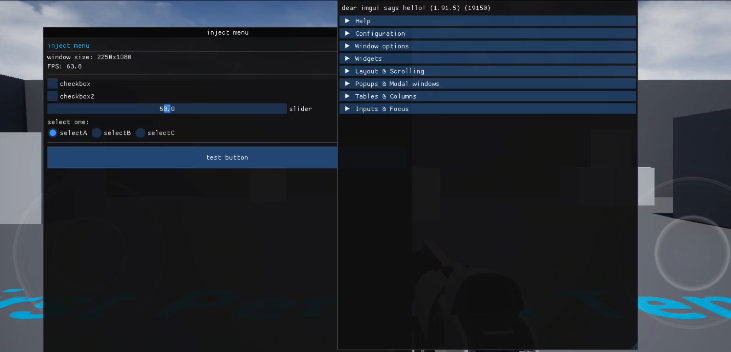

## WIP : ImGui Android Vulkan Hook

This project demonstrates an overlay implementation using ImGui with Vulkan for Android applications. It includes function hooks to inject a custom graphical menu and intercept touch events. Designed for educational and experimental purposes only.

## TODO

> This project adapt to ue4(which use vulkan)

* [X]  Fix touch event handling for mod menu.
  > *touch event have a little problem for scale*
  
* [X]  Fix a series of problems caused by using `Home`.
* [X]  Fix screen rotation `preTransform` for imgui.

## Test

## Documentation
`Menubyvkcreate.cpp` specialized for games loaded `libVulkan.so` fast that data could not be captured

## Requirements

- **Android NDK** for building native libraries.
- Vulkan-capable Android device.
- External libraries:
  - [ImGui v1.95.x](https://github.com/ocornut/imgui)
  - [Dobby Hooking Library](https://github.com/jmpews/Dobby)
